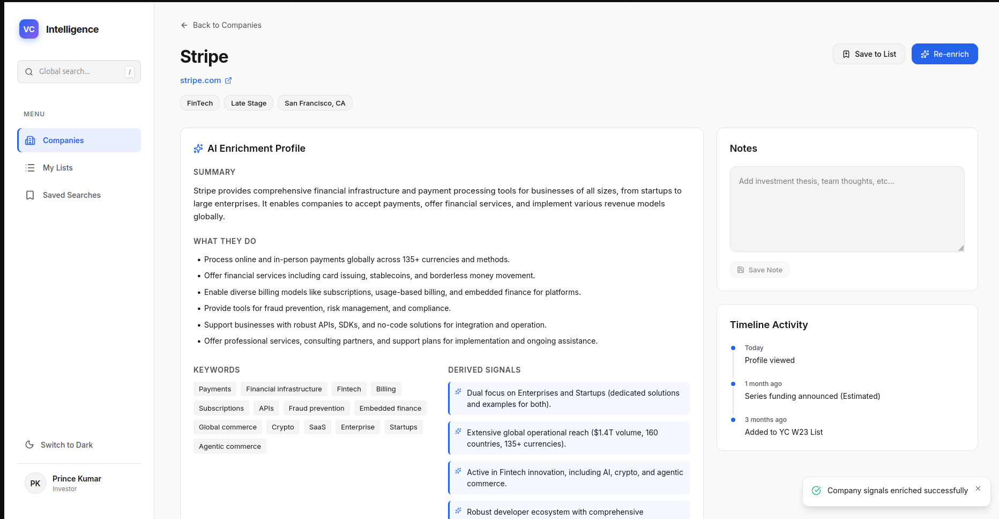
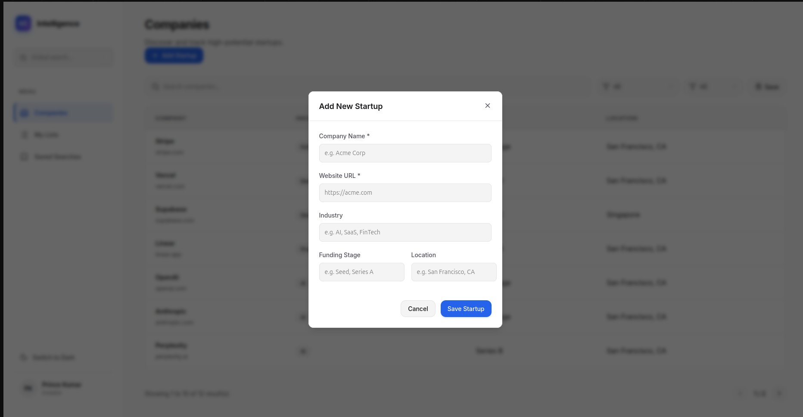
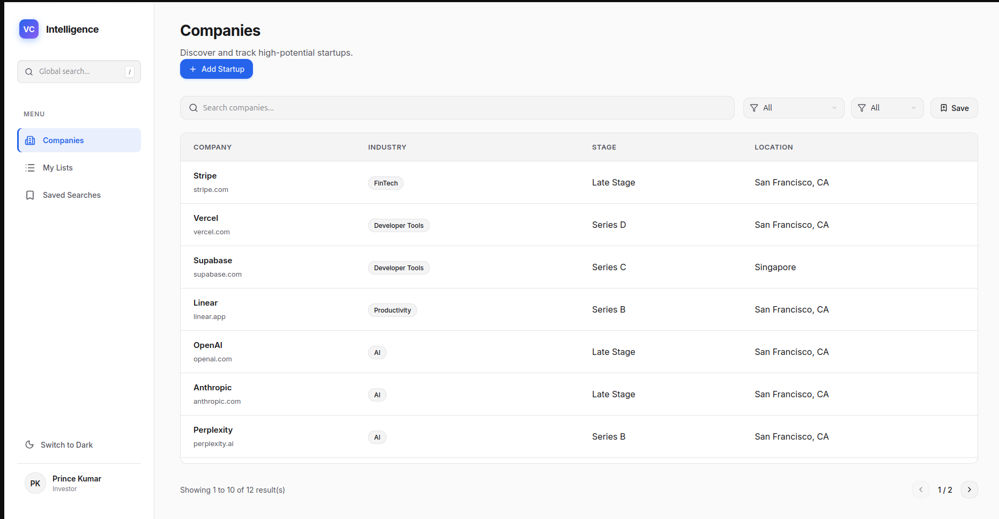
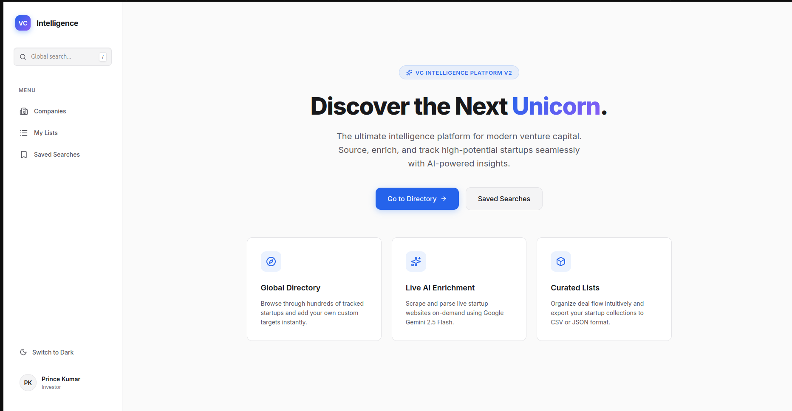
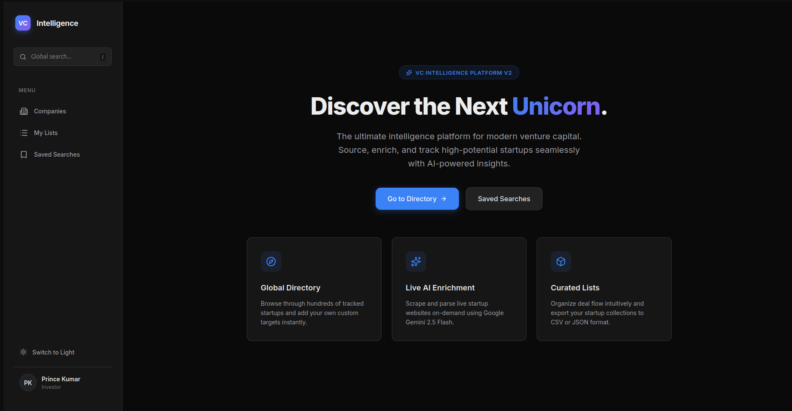

# VC Intelligence Interface

A premium, functional VC discovery interface designed as a modern SaaS application. Features live AI data enrichment, curated startup lists, saved searches, custom theming, and dynamic profile views. Built for investors to streamline startup sourcing workflows.

## 📸 Previews

### 1. Home Dashboard


### 2. Company Directory & Add Startup


### 3. Live AI Enrichment


### 4. Custom Lists & Exporting


### 5. Saved Search Filters


## 🚀 Core Features & V2 Updates

- **SaaS UI Redesign**: Premium side-navigation and central view with unified custom `<Modal>` and global `<Toast>` notifications (no native browser pop-ups).
- **Light/Dark Mode**: Built-in `ThemeProvider` syncing smoothly with `localStorage` CSS variables for comfortable long-session viewing.
- **Dynamic Company Directory**: Add new startups manually via the UI. Custom URLs are merged with the mock database natively, allowing you to instantly profile, save, and enrich newly discovered companies.
- **Advanced Search & Filters**: Instantly find startups based on industry and funding stage.
- **Save Searches**: Persist your filter criteria using `localStorage` to quickly re-run queries later.
- **Lists Functionality**: Tag startups into unique custom collections, and export them directly to `.CSV` or `.JSON` effortlessly.
- **Live AI Enrichment Endpoint (`/api/enrich`)**: Secure, server-side dynamic API endpoint that fetches any public company webpage and passes standard HTML to the Gemini 2.5 Flash LLM. Returns structured, actionable startup insights (Summary, Keywords, What they do, and inferred signals) without exposing API keys to the client.

## 🛠 Tech Stack

- **Framework**: Next.js 16.1.6 (App Router)
- **Styling**: Vanilla CSS Modules & global CSS Variables (No Tailwind CSS)
- **Icons**: Lucide React
- **Data Extractor**: Google Gemini 2.5 Flash via native `fetch` API server proxy
- **State Management**: Standard React context (`ThemeContext`, `ToastContext`) mapped to local/session Storage persistence APIs.

---

## 🏛 Project Architecture & Detailed Context

### 📂 Directory Structure

```text
src/
├── app/
│   ├── api/enrich/route.ts       # Serverless function handling the Gemini AI prompt & scraping
│   ├── companies/                # Company Directory Dashboard (lists all startups + Search/Filter logic)
│   │   └── [id]/page.tsx         # Dynamic Dynamic Profile View (handles Enrichment, Notes, Timeline)
│   ├── lists/page.tsx            # Curated Lists dashboard + CSV/JSON export handlers
│   ├── saved/page.tsx            # Saved Searches dashboard
│   ├── layout.tsx                # Wraps the visual App Shell (Sidebar) + Global Context Providers
│   └── globals.css               # Global Reset + Core CSS Variables (Light/Dark themes)
├── components/
│   ├── Sidebar.tsx               # Primary App Navigation + Theme Toggle
│   ├── Modal.tsx                 # Unified Modal overlay component used for forms & confirmations
│   └── Toast.tsx                 # Non-intrusive floating notification pop-ups 
├── contexts/
│   ├── ThemeContext.tsx          # React Context persisting system/user Dark/Light preferences
│   └── ToastContext.tsx          # Provider tracking and auto-dismissing notification toasts
├── data/
│   └── mockCompanies.json        # The base structural JSON dataset representing the VC database
└── lib/
    └── types.ts                  # Shared TypeScript interfaces (Company, EnrichmentData, etc.)
```

### 🧠 State Management Philosophy

This application avoids bloated third-party state libraries (like Redux or Zustand) and instead relies purely on **React Context + Browser Storage APIs** to emulate a persistently available backend:

1. **`localStorage` (Persistent across sessions)**:
   - `vc_theme`: Remembers the user's Dark/Light mode preference.
   - `vc_notes`: Saves text-area notes written on specific company profiles.
   - `vc_lists`: Stores user-curated company collections.
   - `vc_searches`: Archives specific search queries and filter combinations.
   - `vc_enrichment`: Caches previously enriched Gemini AI responses so users don't burn API credits reloading the same page.
   - `vc_custom_companies`: Stores startups aggressively added via the "Add Startup" modal, merged directly with the Mock dataset on render.

2. **`sessionStorage` (Ephemeral routing state)**:
   - `vc_pending_search`: Handles "Run Search" mechanics where a user clicks a saved query on the `/saved` page, transferring those exact filter settings to the `/companies` page upon redirect.

### 🤖 Live AI Enrichment (`/api/enrich`)

The core engine of this platform resides in the **Live Enrichment** functionality.

When an investor clicks "Enrich" on a company profile (e.g., `acme.com`), the following flow executes:
1. The Next.js API route (`/api/enrich/route.ts`) fetches the raw HTML from the target startup's public URL directly.
2. The server aggressively sanitizes the HTML via Regex, stripping away scripts, styles, forms, headers, and navigation menus to compress the token size.
3. The compressed text payload is passed strictly to the **Google Gemini 2.5 Flash** LLM acting as a data-parser.
4. The LLM is given a hard requirement (and schema constraint) to map the unstructured landing page text into a strictly typed JSON object detailing:
   - A brief executive summary.
   - A bulleted list of "What they do".
   - SEO / Concept Keywords.
   - Inferred "Signals" (e.g., "Mentioned Enterprise Security", "Shows Pricing Page").
5. The JSON object is returned securely to the frontend React Client to be cleanly visualized. **The prompt logic and API keys are entirely hidden on the server instance.**

---

## 💻 Local Setup Instructions

### 1. Install dependencies

```bash
npm install
```

### 2. Set up Environment Variables

To utilize the Live Enrichment tool (the "Enrich" button in the company profile view), you need to provide a Google Gemini API key.

1. Copy `.env.local.example` to `.env.local`:
   ```bash
   cp .env.local.example .env.local
   ```
2. Open `.env.local` and add your Gemini API Key. (You can generate one for free from Google AI Studio).
   ```text
   GEMINI_API_KEY=your_gemini_api_key_here
   ```

### 3. Run Development Server

```bash
npm run dev
```

Visit `http://localhost:3000` to preview the Intelligence UI.

---

## 🌍 Deployment

This application is SSR (Server-Side Rendring) compatible and production-ready for platforms like Vercel or Netlify. 

**Critical Step:** Ensure that the `GEMINI_API_KEY` is added to the Environment Variables settings of your deployment console for the production environment so the `/api/enrich` endpoint retains functionality. No extra configuration needed.
